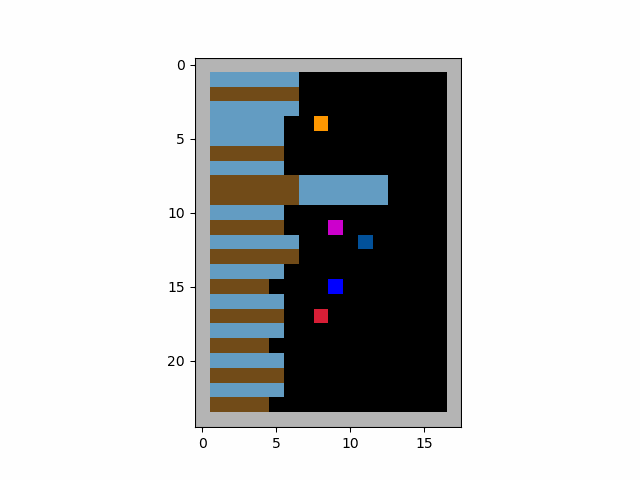

# Sequential Social Dilemma with PPO Agents Based on PyTorch

This repository contains benchmark code for Sequential Social Dilemma (SSD) training, offering support for both the classic SSD environments ([CleanUp and Harvest](https://github.com/eugenevinitsky/sequential_social_dilemma_games)) and the [MeltingPot 2.0](https://github.com/google-deepmind/meltingpot) environments. 
It features comprehensive implementations encompassing the environment setup, PPO agent configuration, and an independent learning training workflow. 
Designed with flexibility in mind, the codebase facilitates the use of both CNNs and RNNs, embraces multi-process sampling techniques, and integrates a variety of widely adopted tricks to enhance performance and efficiency.
## Result
Training five PPO agents with the collective reward leads to a clear emergence of division of labor and coordination.

## Setup
* **Python version**. If you don't use meltingpot, you can install `python 3.8` or newer.
Otherwise, you need `python 3.11`.
* **Packages**. You just need install the latest version of following packages: `pytorch`,`numpy`,`gymnasium`,`pettingzoo`,`wandb`,`matplotlib`,`opencv-python`.
If you want to employ meltingpot, you need install meltingpot according to <https://github.com/google-deepmind/meltingpot>.
## Main Components
### `\ssd_pettingzoo`
This folder contains the classic CleanUp and Harvest environments as well as components supporting multithreading.
The code of environments is from <https://github.com/eugenevinitsky/sequential_social_dilemma_games>, where we fix some bugs.

### `\ssd_pettingzoo`
This folder includes tools for MeltingPot support as well as components for multithreading. 
The environments themselves require the installation of [MeltingPot 2.0](https://github.com/google-deepmind/meltingpot).

### `main_ppo_clean_up.py`
This file hosts the implementation for training the classic CleanUp environment utilizing independent PPO.

### `main_ppo_clean_up_meltingpot.py`
This file hosts the implementation for training CleanUp from meltingpot environment utilizing independent PPO.

### `ppo_agent.py`
Implementation of PPO, supporting CNN and RNN.

### `normalization.py`
Normalization class.

### `replaybuffer.py`
Implementation of a vectorized experience replay buffer.

### `utils.py`
Some utils.

## Acknowledgements
The implement of PPO references the repository https://github.com/Lizhi-sjtu/MARL-code-pytorch.

The support tools of MeltingPot 2.0 are from https://github.com/rstrivedi/Melting-Pot-Contest-2023.